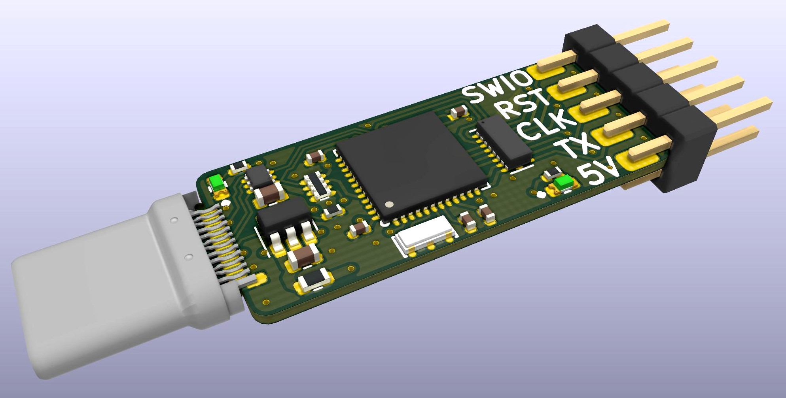
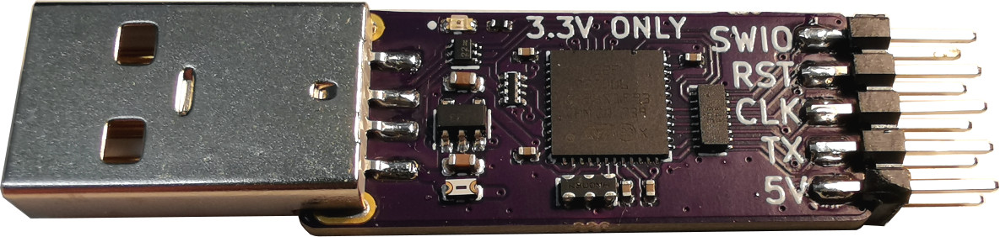
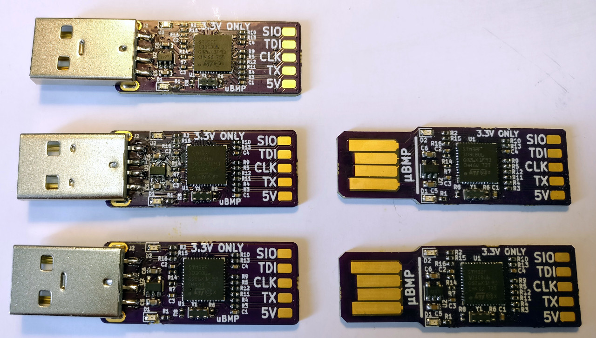
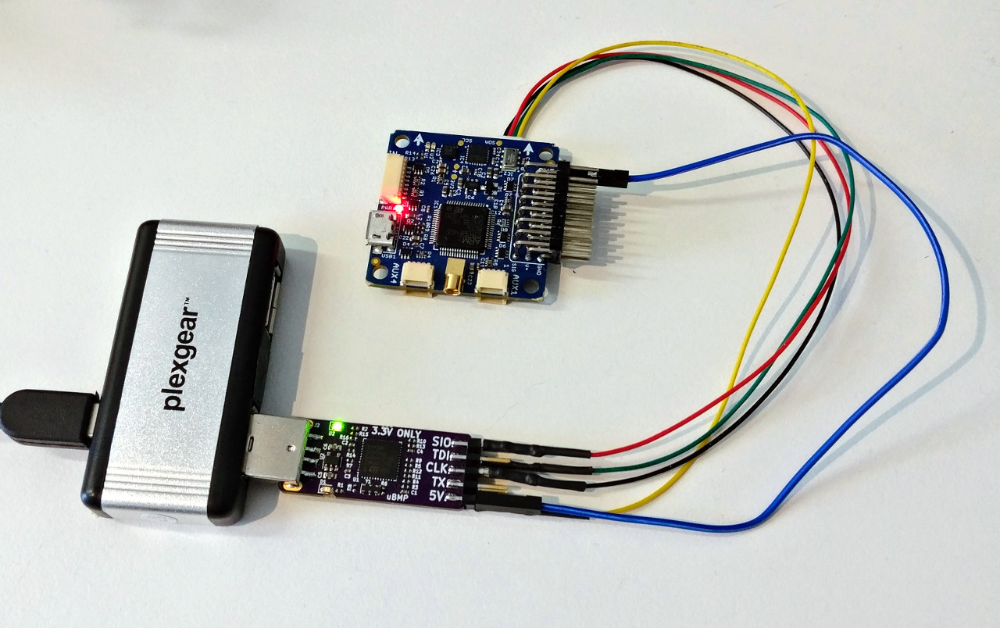

# Micro Black Magic Probe (µBMP)

A small [Black Magic Probe](https://github.com/blacksphere/blackmagic) based on the pinout of the STLink V2 support firmware. Connections has been added for the support of SWO, while the UART pinout is also available. Designed to stick directly into a USB port, without cable.

## Changes

### v1.4.1

* Reinforced the USB-C plug's mounting pads

### v1.4

* Changed to USB-C plug

### v1.3

* Added LED on the 5V line to see when the fuse is "blown"
* Removed panelized boards, to be updated later

### v1.2

* Removed component designators to clean up the PCB, the designators are available in the Gerbers
* Consolidated components, using resistor arrays and 8ch ESD/EMI filter
* Now have ESD/EMI protection on the outputs
* Added fuse of 5V line

### v1.0

* First release
* Tested and working

## Resources

### Schematics

A PDF print of the schematic are available in `ubmp_v1_3.pdf`.

### Programming instructions


Clone and build `stlink` unless you already have it:

```bash
cd ~/git
git clone --recursive https://github.com/texane/stlink
cd stlink
make -j4
```

Clone and build the firmware for `Black Magic Probe`, note to use `stlink` as `PROBE_HOST`:

```bash
cd ~/git
git clone --recursive https://github.com/blacksphere/blackmagic.git
cd blackmagic
cd libopencm3
make -j4 lib
cd ../src
make -j4 PROBE_HOST=stlink
```

Flash the `uBMP`:

```bash
cp ../../stlink/build/Release/st-flash .
./st-flash erase
./st-flash write blackmagic_dfu.bin 0x8000000
./st-flash --reset write blackmagic.bin 0x8002000
```

## Images

### USB-C version (v1.4)


### Second batch (v1.2)


### First batch (v1.0)




